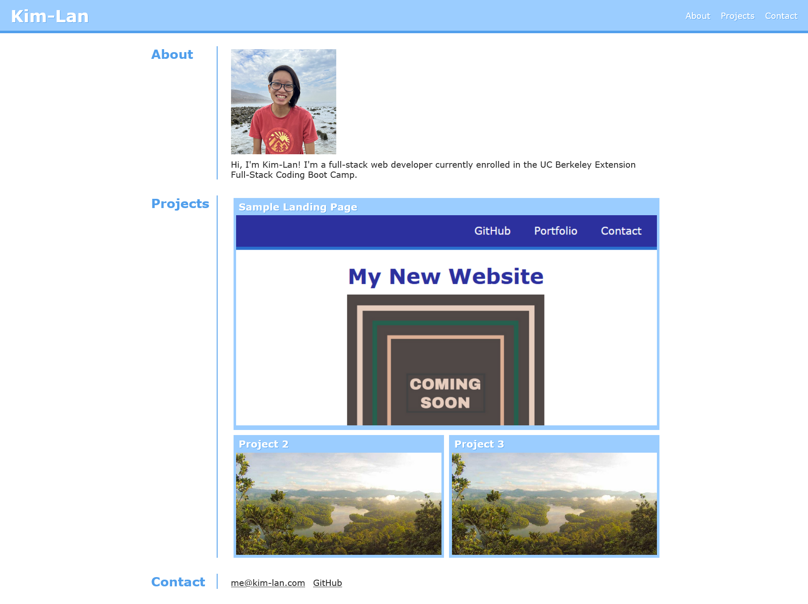

# Portfolio

## Description

A personal portfolio page made with HTML and CSS. The page contains an About section, a Projects section, and a Contact section. The page features responsive design achieved through CSS.

## Screenshot

## Deployment

This page is deployed to GitHub Pages at [https://kim-lan.github.io/bootcamp-module-02-portfolio/](https://kim-lan.github.io/bootcamp-module-02-portfolio/)
